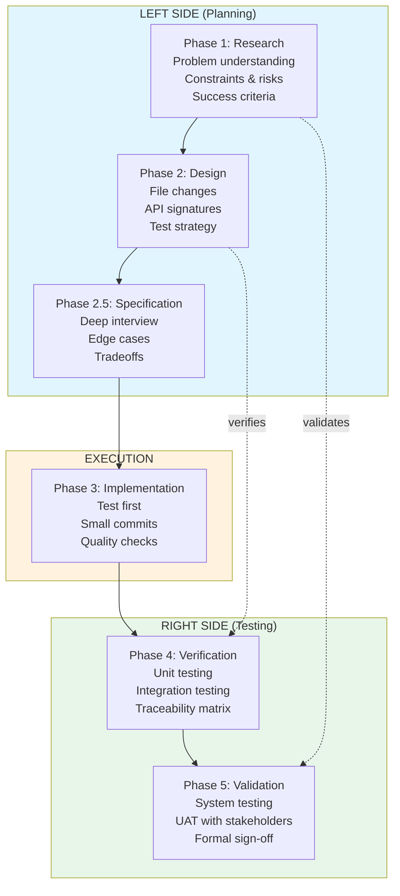
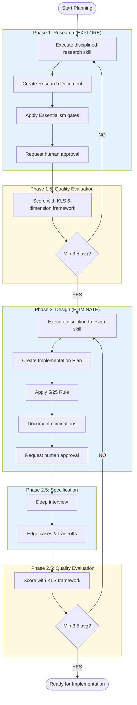
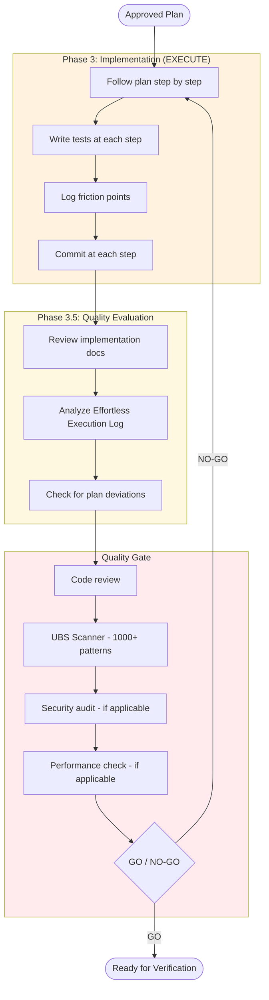
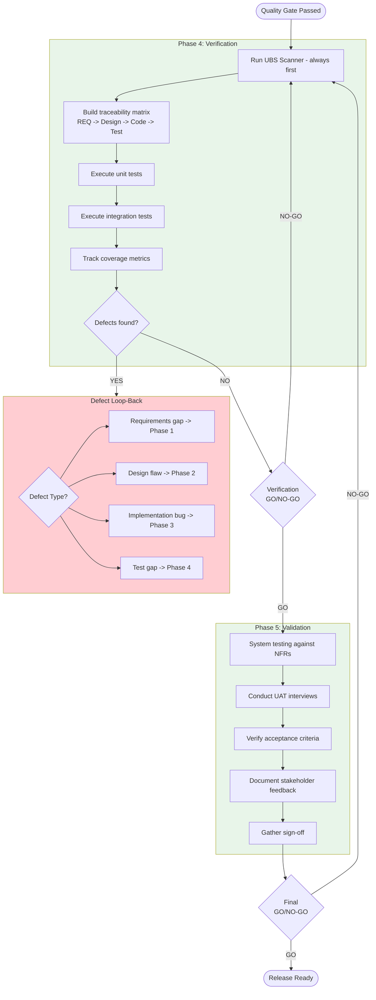
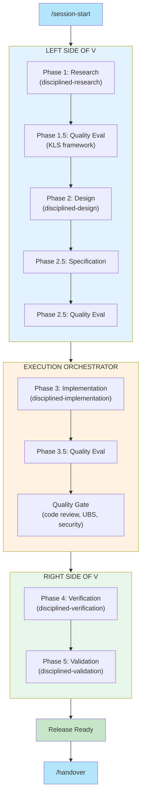

# Terraphim Skills: A Disciplined Development Framework for AI-Assisted Engineering

**TL;DR:** Terraphim Skills implements a V-model development process as Claude Code skills, combining Greg McKeown's Essentialism philosophy with systematic quality gates. The workflow flows from session start through left-side planning, execution orchestration, right-side verification, and concludes with structured handover.

---

## The Problem with AI-Assisted Development

AI coding assistants are powerful, but power without discipline leads to chaos. Common issues include:

- **Scope creep**: AI eagerly adds features nobody asked for
- **Missing requirements**: Jumping to code before understanding the problem
- **No traceability**: Can't trace code back to requirements
- **Heroic effort**: Pushing through complexity instead of simplifying
- **Knowledge loss**: Session ends, context disappears

Terraphim Skills addresses these with a structured framework based on two complementary philosophies from Greg McKeown:

1. **Essentialism**: The disciplined pursuit of less - focus on the vital few
2. **Effortless**: Making essential work easy - find the simpler path

---

## The V-Model: A Visual Overview



The dotted arrows show traceability: Phase 4 verifies Phase 2 design was built correctly; Phase 5 validates Phase 1 requirements were actually solved.

---

## The Complete Workflow

### 1. Session Start

Every disciplined session begins with explicit context establishment:

```
/session-start
```

This skill:
- Creates a tracked development session
- Establishes the working context (branch, recent commits)
- Links to relevant GitHub issues
- Sets up auto-documentation for session progress

**Why it matters:** Without explicit session boundaries, work bleeds across contexts. Session start creates a clean slate with clear scope.

---

### 2. Left Side of V: Planning Phases

The `left-side-of-v` agent orchestrates research and design before any code is written.



#### Phase 1: Research (EXPLORE)

Uses the `disciplined-research` skill to produce a Research Document answering:

- What problem are we solving?
- What's the current state?
- What constraints exist (technical, business, integration)?
- What are the risks?
- What questions remain open?

**Essentialism Integration:**
- Essential Questions Check: Does this energize? Leverage strengths? Meet a real need?
- Vital Few: Identify maximum 3 essential constraints
- 5/25 Rule: Document what's explicitly NOT being investigated

#### Phase 1.5: Quality Evaluation

Before proceeding to design, the `disciplined-quality-evaluation` skill scores the research using the KLS 6-dimension framework:

| Dimension | Question |
|-----------|----------|
| Syntactic | Is it well-formed and complete? |
| Semantic | Does it accurately represent the domain? |
| Pragmatic | Is it useful for the intended purpose? |
| Social | Will stakeholders understand and accept it? |
| Organizational | Does it fit the organizational context? |
| Technical | Is it technically feasible and sound? |

**Gate:** Minimum 3.0 per dimension, 3.5 average required to proceed.

#### Phase 2: Design (ELIMINATE)

Uses the `disciplined-design` skill to produce an Implementation Plan:

- Exact files to change
- Function signatures and types
- Step-by-step implementation sequence
- Test strategy for each step
- Eliminated options (what we decided NOT to do)

**Essentialism Integration:**
- 5/25 Rule: Circle top 5 features, remaining 20 become "Avoid At All Cost"
- Simplicity Check: "What if this could be easy?"
- Elimination Mandate: Document what we're removing, not just adding

#### Phase 2.5: Specification Interview

Optional but powerful: the `disciplined-specification` skill conducts a structured interview to probe:

- Edge cases not covered in design
- Tradeoffs between approaches
- Hidden requirements
- Error handling scenarios
- Performance expectations

**Output:** Specification Interview Findings appended to the design document.

---

### 3. Execution Orchestration: Implementation Phase

The `execution-orchestrator` agent manages Phase 3 with integrated quality assurance.



#### Phase 3: Implementation (EXECUTE)

Uses the `disciplined-implementation` skill to:

- Follow the approved plan exactly (no scope creep)
- Write tests at each step (test-first)
- Make one commit per step (reviewable units)
- Log friction points (Effortless Execution tracking)

**Effortless Execution Log:**
Throughout implementation, the skill tracks:
- Steps that felt heroic (should have been simpler)
- Friction points encountered
- Deviations from plan (require explicit approval)
- Simplification opportunities for future

If friction is systemic, STOP and review the design.

#### Quality Gate

Uses the `quality-gate` skill for comprehensive review:

| Check | When |
|-------|------|
| Code review | Always |
| UBS Scanner (1000+ bug patterns) | Always |
| Requirements traceability | Always |
| Security audit | If touching auth, crypto, secrets |
| Performance check | If touching hot paths |

**Gate:** GO/NO-GO decision for verification phase.

---

### 4. Right Side of V: Verification and Validation

The `right-side-of-v` agent orchestrates testing phases after implementation.



#### Phase 4: Verification

Uses the `disciplined-verification` skill to answer: "Did we build it right?"

**Specialist Skills Invoked:**
- `ubs-scanner`: 1000+ bug patterns across 8 languages
- `requirements-traceability`: Matrix construction and gap analysis
- `code-review`: Quality verification
- `security-audit`: If applicable
- `rust-performance`: If applicable
- `testing`: Test suite execution

**Defect Loop-Back:**
When defects are found, they're traced to their origin:

| Defect Type | Returns To |
|-------------|------------|
| Requirements gap | Phase 1 (Research) |
| Design flaw | Phase 2 (Design) |
| Implementation bug | Phase 3 (Implementation) |
| Test gap | Phase 4 (Verification) |

#### Phase 5: Validation

Uses the `disciplined-validation` skill to answer: "Did we solve the right problem?"

**Process:**
1. System testing against non-functional requirements
2. User acceptance testing (UAT) with stakeholders
3. Verify acceptance criteria are met
4. Gather stakeholder sign-off
5. Final GO/NO-GO for release

---

### 5. Handover: Preserving Context

The `/handover` skill generates a comprehensive handover document for async collaboration:

```markdown
# Handover Document - [Project Name]

**Date:** [Date]
**Branch:** [Branch]
**Last Commit:** [Hash]

## Progress Summary
### Tasks Completed This Session
1. [Specific task with commit reference]
2. [Another task]

### Current State
**What's Working:** [List]
**What's Blocked:** [List with reasons]

## Technical Context
- Branch, commits, modified files
- Key decisions made
- Open questions

## Next Steps
### Priority 1: [Most critical]
### Priority 2: [Important]
### Priority 3: [Nice to have]
### Priority 4: [Future consideration]

## Related Issues
| Issue | Title | Status |
|-------|-------|--------|
| #123 | [Title] | [Open/Closed] |
```

**Why it matters:** AI sessions are ephemeral. Without structured handover, the next session (human or AI) starts from scratch. Handover preserves:
- What was done
- Why decisions were made
- What's next
- Known issues and blockers

---

## The Complete Flow



---

## Key Principles

### The 90% Rule
If it's not a clear YES (90%+ fit), it's a NO. Applied at every gate.

### No Heroics
If something feels hard, stop and simplify. Log friction for process improvement.

### Explicit Elimination
Document what you decided NOT to do. The "Avoid At All Cost" list is as important as the "To Do" list.

### Defect Loop-Back
Never just fix bugs - trace them to their origin. A bug in code might be a gap in research.

### Quality Gates Block
No phase transition without passing quality checks. Gates are mandatory, not advisory.

---

## Getting Started

Install terraphim-skills as a Claude Code plugin:

```bash
# Add the marketplace
claude plugin marketplace add terraphim/terraphim-skills

# Install the plugin
claude plugin install terraphim-engineering-skills@terraphim-skills
```

Start a disciplined session:

```
/session-start
```

Then invoke the left-side-of-V agent for planning:

```
Use the left-side-of-v agent to plan implementation of [your feature]
```

After planning approval, use execution orchestrator:

```
Use the execution-orchestrator agent to implement the approved plan
```

After implementation, verify and validate:

```
Use the right-side-of-v agent to verify and validate the implementation
```

Finally, create handover:

```
/handover
```

---

## Conclusion

Terraphim Skills transforms AI-assisted development from "vibe-based coding" to disciplined engineering. By implementing the V-model as Claude Code skills with quality gates at each phase, it ensures:

- **Research before design**: Understand the problem first
- **Design before code**: Plan the solution
- **Test at every step**: Verify continuously
- **Trace everything**: Requirements to tests
- **Preserve knowledge**: Structured handover

The framework embodies Essentialism ("less but better") and Effortless ("what if this could be easy?") at every phase. The result: AI that helps you build the right thing, the right way, with full traceability and no heroics.

---

**Resources:**
- [Terraphim Skills GitHub](https://github.com/terraphim/terraphim-claude-skills)
- [Essentialism by Greg McKeown](https://gregmckeown.com/books/essentialism/)
- [Effortless by Greg McKeown](https://gregmckeown.com/books/effortless/)

---

*Published: January 2026*
